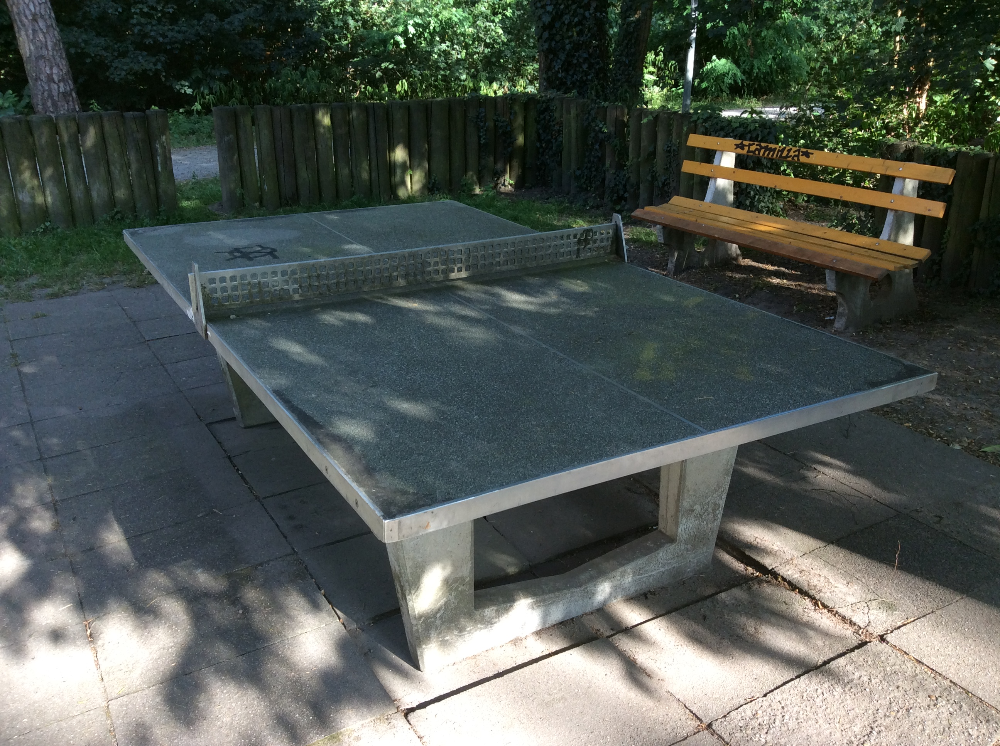
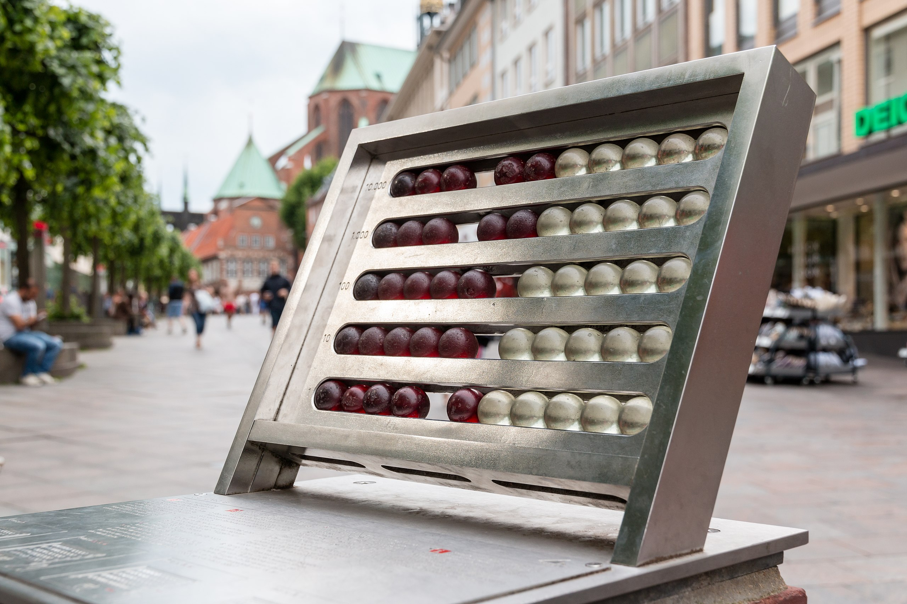

# Text Section (Chapter 1a)

Document set as US English. Doc style Comfy Elephant. Citation style CMOS Author
Date.

## **What you will find in this section:**

-   Use of optional Fidus Writer sections: Subtitle, Author (2), Abstract,
    Keywords

-   Unordered list

-   Indented unordered list

-   Ordered list

-   Ordered list with number start set

-   Indented ordered list

-   Text

-   H1, H2, H3, H4, H5, H6

-   Code formatting

-   Images with captions, with no captions. Listed and not listed as figure.
    Image at 100%, 50%, 25%. Using an image category.

-   Tables, images as tables

-   Math, image as math

-   References

-   Footnotes

-   Web URLs; Internal Fidus Writer document links, Anchors

-   Text formatting: bold, italic, underline

-   Blockquote

-   Copyright information using Fidus Writer document information setting

-   Language setting

## **Start of text**

Lorem ipsum dolor sit amet, consectetur adipiscing elit. Duis ut enim diam.
Aliquam erat volutpat. Ut commodo nibh ut maximus sodales. Mauris a enim non
neque bibendum tincidunt at et eros. Nunc sed rutrum nibh. Nam vulputate
pharetra velit euismod ullamcorper. Duis nec ligula nec magna facilisis luctus.
Aliquam id accumsan leo. Etiam at velit vulputate, consequat leo id, imperdiet
ante. Integer eget ornare turpis, eu convallis velit.

### **Lists**

#### Ordered list:

-   Nulla ac felis et dolor porttitor auctor nec eget orci.

-   Integer aliquet purus maximus sem sagittis, vitae condimentum est tempus.

-   Pellentesque sed ligula eget lacus scelerisque aliquet.

-   Phasellus non nulla vitae sapien lobortis dictum.

-   Etiam imperdiet risus in efficitur dictum.

#### Indented Ordered list:

-   Nulla ac felis et dolor porttitor auctor nec eget orci.

-   1 indent: Integer aliquet purus maximus sem sagittis, vitae condimentum est
    tempus.

-   2 indent

-   3 indent

-   4 Indent

-   Etiam imperdiet risus in efficitur dictum.

#### Ordered list:

1.  Maecenas pulvinar vel metus in bibendum.

2.  Mauris congue odio sit amet velit ultrices posuere.

3.  Vivamus pellentesque porttitor ligula in volutpat.

4.  Proin et porta mauris, sed sodales ligula.

5.  Fusce gravida facilisis dui, ut tristique lacus volutpat nec.

6.  Integer vitae sagittis mauris, non porttitor urna.

#### Ordered list two - with start number set as 5 using the Fidus Writer setting:

1.  Maecenas pulvinar vel metus in bibendum.

2.  Mauris congue odio sit amet velit ultrices posuere.

3.  Vivamus pellentesque porttitor ligula in volutpat.

4.  Proin et porta mauris, sed sodales ligula.

5.  Fusce gravida facilisis dui, ut tristique lacus volutpat nec.

6.  Integer vitae sagittis mauris, non porttitor urna.

#### Indented ordered list

1.  Maecenas pulvinar vel metus in bibendum.

2.  Mauris congue odio sit amet velit ultrices posuere.

3.  Vivamus pellentesque porttitor ligula in volutpat.

4.  Proin et porta mauris, sed sodales ligula.

5.  Fusce gravida facilisis dui, ut tristique lacus volutpat nec.

6.  Integer vitae sagittis mauris, non porttitor urna.

7.  Sed tincidunt, dui ut ullamcorper tempor, dolor velit feugiat ex, et
    imperdiet mauris leo quis velit.

### **Text**

Integer lacinia dui in eleifend aliquam. Mauris eleifend eget justo vitae
viverra. Nulla tempus maximus metus, ac fermentum velit placerat vel. Integer
accumsan leo in nunc tincidunt placerat. Nunc sed nunc a risus semper
condimentum. Aenean non egestas leo. Nulla id turpis varius, venenatis nibh et,
ultrices nisi. Aliquam ultrices dapibus sapien a finibus. Vivamus in
sollicitudin nibh. Proin eros quam, volutpat a facilisis sit amet, mattis eget
lorem. Etiam scelerisque in felis eu sollicitudin. Integer vel vehicula risus.
Morbi vestibulum est erat, faucibus molestie sapien sodales in.

Praesent ornare massa in turpis sodales, id fringilla massa malesuada. Nam
gravida urna sit amet neque sollicitudin aliquet. Praesent tristique magna vel
pretium laoreet. Nam dictum at velit non euismod. Nam et elementum metus. Sed ac
lacus vitae justo volutpat vulputate eget nec urna. Nulla facilisi. Quisque
faucibus mollis venenatis.

Mauris est felis, vestibulum eget ligula sit amet, scelerisque ornare tortor.
Quisque auctor magna a sem iaculis, vitae volutpat nibh ornare. Nulla rutrum
varius nibh vitae pharetra. Curabitur leo tellus, pharetra eget eros quis,
posuere iaculis lorem. Nam iaculis augue neque, id tempus dui congue sed. Nullam
eget ultrices purus. In et arcu id est egestas tincidunt. Proin vel fringilla
nisi, non tempor purus.

Aenean tincidunt arcu nisi, et cursus ligula facilisis eu. Sed ut leo lacus.
Proin eget risus risus. Curabitur varius ligula eu mauris pulvinar molestie.
Mauris fringilla risus magna. Vivamus lacus sem, placerat ut viverra non,
rhoncus eget dolor. Fusce ut arcu rutrum dolor ornare hendrerit. Vestibulum ut
porttitor tellus, a venenatis elit. Nullam sit amet rhoncus nibh, ac eleifend
ante. Sed quis venenatis diam, eget euismod metus. Integer sed viverra erat.
Pellentesque ac purus tellus. Nam id pretium tortor, vel tempor libero. Sed quis
elementum risus. Curabitur est ante, posuere non purus ut, pharetra dictum
lacus. Aliquam hendrerit sagittis neque, eu elementum odio lacinia non.

Maecenas rutrum maximus arcu, at scelerisque nisi luctus suscipit. Nunc lobortis
a arcu et fermentum. Etiam nulla nunc, elementum vitae luctus non, faucibus ut
sem. Cras quis pellentesque nulla. Maecenas mauris turpis, volutpat vel tellus
eu, condimentum ultrices ante. Suspendisse sit amet sem a nibh accumsan
placerat. Sed gravida viverra vehicula. Aliquam cursus accumsan quam, ac
tristique sapien pharetra in. Suspendisse eu leo varius massa vehicula pulvinar.
Integer laoreet blandit purus, dapibus viverra nulla fringilla sed. Proin ut
magna consequat, ultrices felis vel, commodo eros. Proin nisl quam, gravida ut
risus ac, posuere fermentum augue. Cras pretium pulvinar nibh vel gravida. In
erat eros, fringilla nec ipsum sodales, tempus egestas dolor. Pellentesque risus
metus, vehicula id magna non, sodales molestie augue.

### **Headers and normal text styles**

# **Header 1**

## **Header 2**

### **Header 3**

#### Header 4

##### Header 5

###### Headers 6

Normal

### **Code style**

Code format is greyed out?

### **Text formats**

**Bold**

*Italic*

**Bold italic**

Underline is greyed out?

### **Images**

Images with captions, with no captions. Image at 100%, 50%, 25%

#### Image with caption, as figure

Included copyright information, 100% size

1: 1: Citation needed FR

#### Image with caption, not figure

With caption, no listing, 50%, left. Copyright information.

Citation needed EN

#### Image with caption, as photo, no caption

Right align, 25%, with copyright

1: 1: 1: Citation needed CN

### **Images**

Some images to allow for counting in figures and photos. Three per type in this
one document.

Figure A

2: 2: 2: Assamese

Figure B

3: 3: 3: Marathi

Figure C

4: 4: 4: Polish

Photo A

2: 2: 2: Jimmy Wales

Photo B

3: 3: 3: March for Science

Photo C

4: 4: 4:

### **Tables**

| **Column 1** | **Column 2** | **Column 3** | **Column 4** |
|--------------|--------------|--------------|--------------|
| Row 1        | data         | data         | data         |
| Row 2        | data         | data         | data         |
| Row 3        | data         | data         | data         |
| Row 4        | data         | data         | data         |
| Row 5        | data         | data         | data         |
| Row 6        | data         | data         | data         |

1: 1: 1: A complex table

### **Math**

Equation:

Equation as image:

Abacus Lübeck, Schleswig-Holstein

### **References**

Nam eleifend augue sit amet faucibus accumsan. Sed felis mi, rutrum sed diam id,
ultrices sodales dui. Sed consectetur sagittis lectus vitae interdum. Nulla
finibus, quam id suscipit ultrices, dui purus commodo mi, at faucibus dolor
sapien eu urna. Quisque cursus, velit vel sollicitudin pellentesque, magna justo
euismod tellus, molestie mollis enim ligula id magna. Maecenas varius orci
ligula, et posuere massa aliquet vel. Integer pellentesque interdum convallis.
Pellentesque lobortis nulla eu ligula sagittis, sed eleifend neque ultricies.
Etiam venenatis arcu diam, non pharetra arcu iaculis sit amet. Sed eros odio,
pellentesque sed tellus quis, aliquet ullamcorper turpis. Quisque eu aliquam
sapien. Curabitur dapibus, metus sit amet varius venenatis, nisi odio lacinia
tortor, non elementum felis mauris vehicula diam. Lorem ipsum dolor sit amet,
consectetur adipiscing elit. Donec nec turpis nec ligula condimentum hendrerit.
Curabitur posuere tortor id odio ullamcorper, sed viverra nisi fringilla.

Nulla eget rhoncus urna. Fusce ultricies quam vel tempor tristique. Pellentesque
habitant morbi tristique senectus et netus et malesuada fames ac turpis egestas.
Vestibulum venenatis lacus sit amet vestibulum aliquam. Suspendisse lobortis
nisl sed libero gravida rhoncus. Suspendisse vestibulum eros ac mi tempor, vitae
faucibus odio bibendum. Nam viverra mauris auctor blandit euismod. Vestibulum
dapibus justo elementum lobortis fermentum.

### **Footnotes**

Nam eleifend augue sit amet faucibus accumsan. Sed felis mi, rutrum sed diam id,
ultrices sodales dui. Sed consectetur sagittis lectus vitae interdum. Nulla
finibus, quam id suscipit ultrices, dui purus commodo mi, at faucibus dolor
sapien eu urna. Quisque cursus, velit vel sollicitudin pellentesque, magna justo
euismod tellus, molestie mollis enim ligula id magna.
[1](https://onlyoffice.adwmainz.net/7.2.1-34/web-apps/apps/documenteditor/main/index_loader.html?_dc=7.2.1-34&lang=en-GB&customer=ONLYOFFICE&frameEditorId=iframeEditor&compact=true&parentOrigin=https://cloud.nfdi4culture.de&uitheme=theme-classic-light#fn-35spv)
Maecenas varius orci ligula, et posuere massa aliquet vel. Integer pellentesque
interdum convallis. Pellentesque lobortis nulla eu ligula sagittis, sed eleifend
neque ultricies. Etiam venenatis arcu diam, non pharetra arcu iaculis sit amet.
Sed eros odio, pellentesque sed tellus quis, aliquet ullamcorper turpis.
[2](https://onlyoffice.adwmainz.net/7.2.1-34/web-apps/apps/documenteditor/main/index_loader.html?_dc=7.2.1-34&lang=en-GB&customer=ONLYOFFICE&frameEditorId=iframeEditor&compact=true&parentOrigin=https://cloud.nfdi4culture.de&uitheme=theme-classic-light#fn-1h7rs)
Quisque eu aliquam sapien. Curabitur dapibus, metus sit amet varius venenatis,
nisi odio lacinia tortor, non elementum felis mauris vehicula diam. Lorem ipsum
dolor sit amet, consectetur adipiscing elit. Donec nec turpis nec ligula
condimentum hendrerit. Curabitur posuere tortor id odio ullamcorper, sed viverra
nisi fringilla.
[3](https://onlyoffice.adwmainz.net/7.2.1-34/web-apps/apps/documenteditor/main/index_loader.html?_dc=7.2.1-34&lang=en-GB&customer=ONLYOFFICE&frameEditorId=iframeEditor&compact=true&parentOrigin=https://cloud.nfdi4culture.de&uitheme=theme-classic-light#fn-3j77u)

Nulla eget rhoncus urna. Fusce ultricies quam vel tempor tristique. Pellentesque
habitant morbi tristique senectus et netus et malesuada fames ac turpis egestas.
Vestibulum venenatis lacus sit amet vestibulum aliquam. Suspendisse lobortis
nisl sed libero gravida rhoncus. Suspendisse vestibulum eros ac mi tempor, vitae
faucibus odio bibendum. Nam viverra mauris auctor blandit euismod. Vestibulum
dapibus justo elementum lobortis fermentum.

### **Web URLs; Internal Fidus Writer document links, Anchors**

URL The historian [Marcus Rediker](https://www.marcusrediker.com/).

Internal link in the document to a [header
anchor](https://onlyoffice.adwmainz.net/7.2.1-34/web-apps/apps/documenteditor/main/index_loader.html?_dc=7.2.1-34&lang=en-GB&customer=ONLYOFFICE&frameEditorId=iframeEditor&compact=true&parentOrigin=https://cloud.nfdi4culture.de&uitheme=theme-classic-light#H1581297)
and to an
[anchor](https://onlyoffice.adwmainz.net/7.2.1-34/web-apps/apps/documenteditor/main/index_loader.html?_dc=7.2.1-34&lang=en-GB&customer=ONLYOFFICE&frameEditorId=iframeEditor&compact=true&parentOrigin=https://cloud.nfdi4culture.de&uitheme=theme-classic-light#A746704).

Anchor

### **Blockquote**

Here below is the full list of ten books that have shaped my life – one
basketball book, one joke book, one autobiography, three novels, and four
history books. One never knows which books will change your life and therein
lies one of the greatest joys of reading. <https://t.co/biMVo4ylZL>

### **Copyright information using Fidus Writer document information setting**

Document set to CC0, 2021, The Author.

### **Language settings**

Document set to US English.

###### 1. A single paragraph note.

###### 2. A double paragraph note.

###### Paragraph two.

###### 3. A note with a citation in it?
